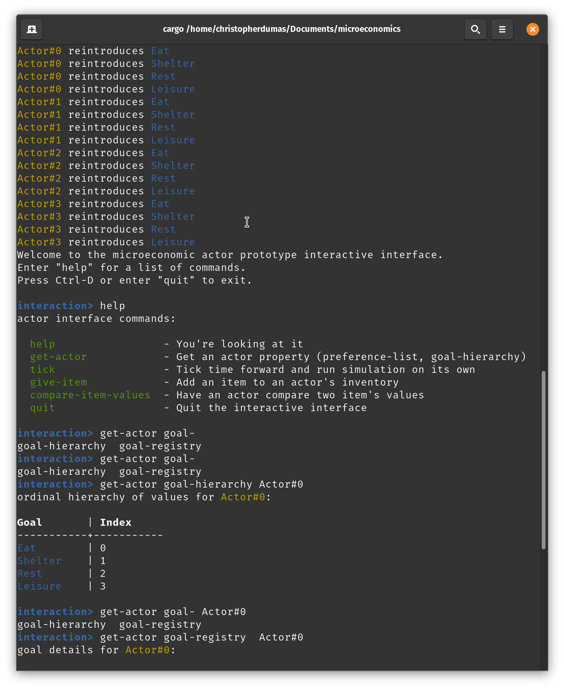
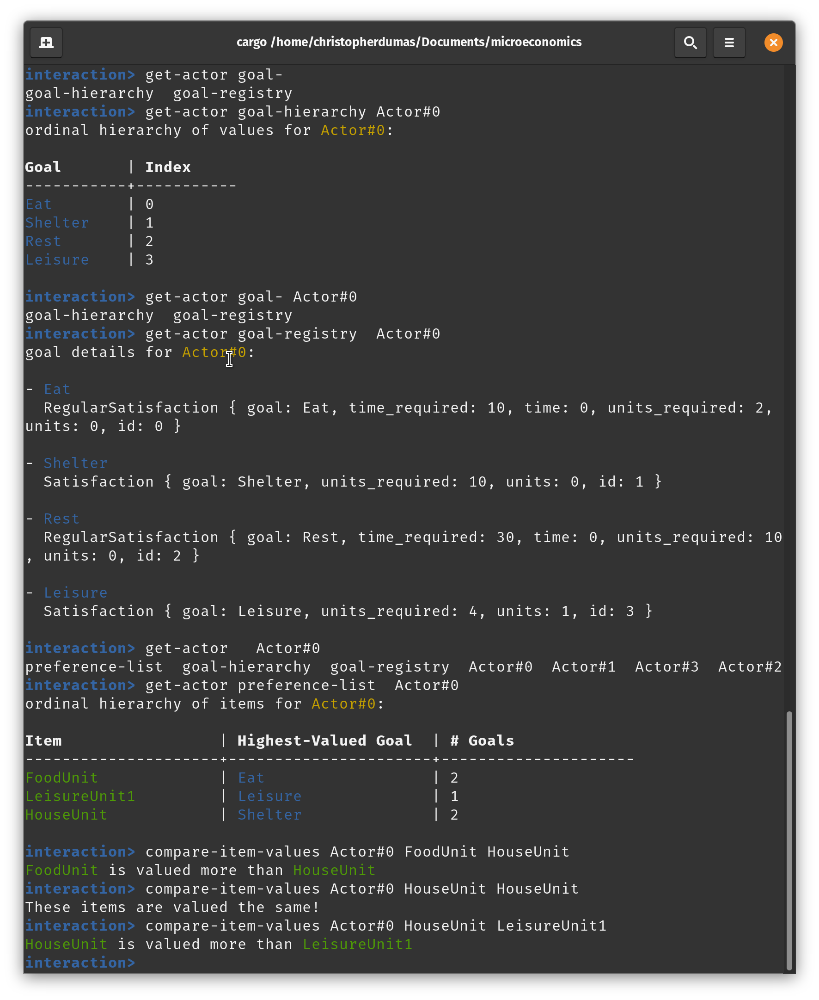

# Austrian Microeconomics
## Computational Economic Simulation

This is a simple proof-of-concept program attempting to simulate a basic
microeconomic actor along the lines of praxeological theory. Although the
full-thought processes and infrastructure, as well as range of actions, possible
to a human actor are not available to a computer (classical AI) actor, and thus
the praxeological simulation is not anywhere near complete, this actor does
value things in accordance with ordinal value scales and marginal utility based
on those scales, as well as initiate transactions and use unit "items."

Whether this deserves the name "praxeological" is up for debate considering that
praxeological is based on the concept and possibilities inherent in *human*
action, including all the wide options available and nuances that that comes
with, while this actor cannot encompass much of that at all, but this is still
an interesting experiment.

# 1 How To Run

Download the project and enter the directory.

- `cargo run` will run the program directly (it requires arguments)
- `cargo build` will build an executable
- `cargo doc --open` will open the extensive code docs I have written

There will be tests eventually.

# 2 Subsystems

There are a few subsystems to this program, which I'll break down below. If you
want information about how these systems are *implemented* (instead of their
telos), check the docs.

## 2.1 Actor

The actor subsystem is the brain, heart, and soul of this program all wrapped
into one. Since this is a microeconomic simulator (using both terms loosely),
everything inherently operates on the level of the individual actor, meaning
that most of the functionality of the system is centered here.

### 2.1.1 Value System

Each actor has a **goal hierarchy**, which is an ordinal list of goals which
represents which goals are valued more highly than the others. This informs
which goals items are used for first, how items are valued, and which goals are
pursued under autonomous action.

Since each item is valued according to the highest-valued goal that the actor
still has to satisfy, then if the first `n` items satisfy Goal X and the
next `k` satisfy Goal Y, the first `n` items will be valued more than the next
`k`, and so on down to Goal Z and further, meaning that we get marginal utility
for free.

The agent keeps a hash-map of items as keys, with a sorted list (technically,
binary heap) of all the goals which they can satisfy for valuation purposes.
This is called the **preference list**.

### 2.1.2 The Goal System

Some goals require multiple items to satisfy, and some recur on a set timer
(after a set number of `tick`s). This means that we need a **goal registry** to
keep track of all the goals the actor currently cares about, recurring and
non-recurring. All other references to goals, in the **goal hierarchy**,
**current goal list** or **preference list**, all use the goal's type (later I
might make this a UID & type instead, in case you get multiple goals of the same
type) into the **goal registry** in order to get the data about its timer and
units still required to satisfy it.

Adding goals on the fly is supported, although it is pretty slow, as is
re-adding goals already on the registry, which is slightly less slow. Removing
goals is *extremely* time consuming, since it requires rebuilding every binary
heap in the **preference list**. See section **1.4**

### 2.1.3 The AI Action System

This is centered in the `tick` function. It has a fairly simple logic system,
which follows this pattern (from the point of view of the AI):

1. Get my highest-valued goal that's currently in play (**single tick**)
    1. If I have an item for which the highest valued goal it can satisfy is
       this goal, use that item right of the bat, and move to the next tick.
       (Have food, will eat).
    1. If I have a few items that can satisfy this need, but their
       highest-valued satisfiable goal is something else, use the least-valued
       item for that. That way, you sacrifice the smallest *other* goal (the
       goal that was that item's actual highest value). This represents
       opportunity cost, I think, but I'm not so sure about this step, it seems
       like it might mess up marginal utility. I'm not sure. It might actually
       be unnecessary.
1. If I have no items that can satisfy this goal, then I need to trade.
   (**multiple ticks**)
    1. With trade, I cycle through every other AI available to me, and ask it
       whether it has an item which it values less than it values the item I
       value least, which can suffice for my selected goal. (**one tick per cycle**)
    1. We cycle through each of the items in my inventory, going upward in value
       (I bid higher and higher offers to buy) until I reach an item in my
       inventory which I value more than the goal I'm trying to satisfy; I don't
       want to sell this item to satisfy my current goal, because then the
       forgone goal (opportunity cost) would be higher than the value I'd
       gained. If at this point I haven't reached a deal, I go to another actor.
       (**one tick per bid**)
       
### 2.1.4 Performance Characteristics

Fast operations:

- Using items
- Looking up and comparing values
- Updating goals (see exception)
- Choosing goals to satisfy, basically doing all of part (1) in the logic above.

Slow operations:

- Trading
- Re-adding recurring items

Pathological operations:

- Using items when the goal has to be removed
- Removing goals
- Adding goals

Because of how much it takes to satisfy goals, removing goals shouldn't happen
that often. True adding goals happens basically never. So performance
characteristics in theory shouldn't be that bad. The fast operations are usually
on the order of O(1), where as slow operations are worst-case O(k\*n) and
pathological operations might approach O(2\*k\*n) or so.

## 2.2 REPL

There's a very nice repl, with highlighting, autocompletion, and everything, for
you to interact with the various actors and inspect their internal state. Since
the actors aren't finished, the REPL isn't finished either for obvious reasons.

### 2.2.1 Screenshots (WIP)

